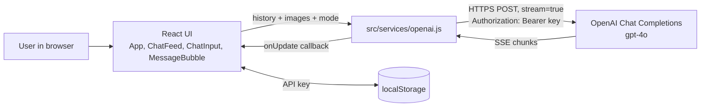

# Vanni: Medical Coding Chat Assistant

A browser-only React chat app that sends medical coding questions (ICD-10-CM, CPT, HCPCS) and images to OpenAI `gpt-4o` and streams the answer back.


Live demo (bring your own OpenAI API key): https://katta041.github.io/Medical-Coding-App/

> **Disclaimer.** Vanni is a personal proof of concept. It is **not** a certified coding tool, encoder or claims scrubber, it is **not** affiliated with or integrated into any commercial encoder product, and it is **not** intended for clinical, billing or compliance use. Every answer is generated by a general-purpose language model and can be wrong. Always verify codes against the official code sets and payer guidance. **Do not enter, paste or photograph protected health information (PHI) or any real patient data.** Anything you type or upload is sent directly to OpenAI under your own API key.

## Overview

Vanni is a single-page application with two chat tabs:

- **Medical**: the model is given a system prompt that tells it to act as an expert medical coder, to check combinations of CPT codes for NCCI (National Correct Coding Initiative) bundling conflicts and modifier indicators, to check ICD-10-CM `Excludes1` / `Excludes2` notes, and to cite official guidelines (AMA CPT, CMS manuals, ICD-10-CM guidelines). Temperature is set to `0.2`.
- **General**: a general-purpose assistant prompt with temperature `0.7`.

There is no backend. The browser calls the OpenAI Chat Completions API directly with the user's API key. The NCCI and Excludes checks are instructions to the model only: the app does not ship or query any NCCI edit tables, code sets or coding rules engine, so results depend entirely on the model.

## Key features

- Two independent conversations (Medical and General), each sending its full in-memory history to the model so follow-up questions keep context.
- Streaming responses over Server-Sent Events, rendered token by token.
- Markdown rendering of answers via `markdown-to-jsx`.
- Image attachments: pick one or more images from the device, or use the camera button (shown on small screens) to capture a photo. Images are read as base64 data URLs and sent to `gpt-4o` as vision input.
- Settings modal to enter an OpenAI API key, saved in the browser's `localStorage`. A key can also be supplied at build time with `VITE_OPENAI_API_KEY`.
- Mobile-first dark UI with an auto-resizing input box.
- Static deployment to GitHub Pages (`npm run deploy`) and a Dockerfile that serves the build with Nginx (see the known issue under Deployment).

## Architecture



- `src/App.jsx` holds tab state, both message lists, the API key and the settings modal.
- `src/services/openai.js` builds the request (system prompt per mode, `max_tokens: 3000`, `stream: true`), parses the SSE stream and calls back with each text chunk.
- Conversation history lives only in React state and is lost on page refresh.

## Tech stack

| Area | Technology |
|---|---|
| UI | React 19, plain CSS |
| Build tool | Vite 8 with `@vitejs/plugin-react` |
| Model API | OpenAI Chat Completions (`gpt-4o`), called with `fetch` |
| Rendering | `markdown-to-jsx`, `lucide-react` icons |
| Linting | ESLint 9 with React Hooks and React Refresh plugins |
| Hosting | GitHub Pages (`gh-pages`), or Docker (Node 20 build stage, Nginx serve stage) |

## Getting started

### Prerequisites

- Node.js `20.19+` or `22.12+` (required by Vite 8) and npm
- An OpenAI API key with access to `gpt-4o`

### Install

```bash
git clone https://github.com/Katta041/Medical-Coding-App.git
cd Medical-Coding-App
npm ci
```

### Configure

The recommended way is to run the app and paste your key into the **Settings** modal (gear icon, top right). It is stored in your browser's `localStorage` under `openai_api_key`.

Optionally, for local development only, copy `.env.example` to `.env.local` and set the key:

| Variable | Required | Description |
|---|---|---|
| `VITE_OPENAI_API_KEY` | No | OpenAI API key used instead of the one saved in Settings. |

**Warning:** Vite inlines every `VITE_*` variable into the JavaScript bundle at build time. If this variable is set when you run `npm run build`, `npm run deploy` or `docker build`, the key will be readable by anyone who can load the site. Only use it with `npm run dev`, and never build or deploy with it set.

### Run

```bash
npm run dev
```

Open http://localhost:5173/Medical-Coding-App/ (the Vite `base` is `/Medical-Coding-App/`).

## Usage

1. Choose the **Medical** or **General** tab.
2. Type a question, for example: "Can CPT 99213 and 20610 be billed together on the same day? Which modifier applies?"
3. Optionally attach an image with the image button (or the camera button on mobile). Use only synthetic or fully de-identified material.
4. Press Enter to send (Shift+Enter for a new line). The answer streams in and is rendered as Markdown.

Switching tabs keeps each conversation separately until the page is reloaded.

## Available scripts

| Command | What it does |
|---|---|
| `npm run dev` | Start the Vite dev server |
| `npm run build` | Build the production bundle into `dist/` |
| `npm run preview` | Serve the built `dist/` locally |
| `npm run lint` | Run ESLint |
| `npm run deploy` | Publish `dist/` to the `gh-pages` branch (run `npm run build` first) |

## Project structure

```
Medical-Coding-App/
├── public/                  # favicon.svg, icons.svg
├── src/
│   ├── components/
│   │   ├── ChatFeed.jsx     # Message list with auto-scroll and typing indicator
│   │   ├── ChatInput.jsx    # Text box, image and camera attachments, send button
│   │   └── MessageBubble.jsx# Renders one message (Markdown for the assistant)
│   ├── services/
│   │   └── openai.js        # OpenAI request, system prompts, SSE stream parsing
│   ├── App.jsx              # Tabs, conversation state, settings modal
│   ├── main.jsx             # React entry point
│   └── *.css                # Styles
├── index.html
├── vite.config.js           # React plugin, base path /Medical-Coding-App/
├── eslint.config.js
├── Dockerfile               # Multi-stage build: Node 20 build, Nginx serve
├── docker-compose.yml       # Maps host port 8080 to container port 80
└── package.json
```

## Testing

There are no automated tests yet. `npm run lint` and `npm run build` both complete without errors.

## Deployment

### GitHub Pages

```bash
npm run build
npm run deploy
```

This pushes `dist/` to the `gh-pages` branch, which serves https://katta041.github.io/Medical-Coding-App/. Make sure `VITE_OPENAI_API_KEY` is not set in your environment or any `.env*` file before building.

### Docker

```bash
docker compose up -d --build   # or: docker-compose up -d --build
```

The container serves the built app with Nginx on http://localhost:8080.

**Known issue:** because `vite.config.js` sets `base: '/Medical-Coding-App/'`, the built `index.html` requests its assets from `/Medical-Coding-App/assets/...`, but the Docker image places them at `/assets/...`. As a result the page loads blank when served from the container root. Until the base path is made configurable, the Docker setup is not usable as-is.

## Status and roadmap

Status: proof of concept, suitable for personal experimentation only.

Possible next steps (not implemented):

- Make the Vite base path configurable so the Docker image works.
- Move OpenAI calls behind a small server-side proxy so the API key never reaches the browser.
- Add unit tests for the stream parser and component tests for the chat flow.
- Add CI for lint and build.
- Ground answers in official code set and NCCI edit data instead of relying on the model alone.

## Security and privacy

- The API key is supplied by the user at runtime (Settings modal, stored in `localStorage`) or, for local development only, via `VITE_OPENAI_API_KEY` in `.env.local`. No key is committed to this repository.
- Requests go directly from the browser to `api.openai.com`; there is no intermediate server. Messages and images are therefore processed by OpenAI under your account's data policies.
- Keys in `localStorage` are readable by any script running on the same origin. Use a restricted key with a spending limit.
- Chat history is held in memory only and is cleared on reload.
- This app is not HIPAA compliant. Do not use it with PHI.

## Licence

No licence has been chosen yet; all rights reserved.

## Author

Rohith Katta, [github.com/Katta041](https://github.com/Katta041)
